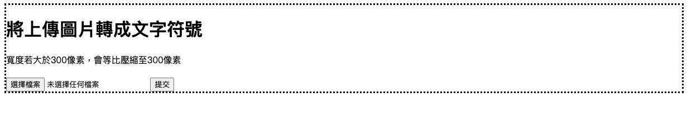

# 圖片轉文字符號

### 使用 docker 建置專案

docker build -t gdp .  
sudo docker run -d -p 3333:3333 gdp  
執行網址 http://localhost:3333/upload/ 即可看到畫面  

## 顯示單/雙線程函式執行時間

### 首頁

### 效果 1 終端機圖示

### 效果 2 貓 （textarea 可滾動，查看全圖）

